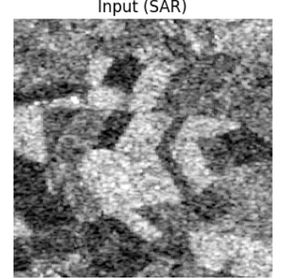
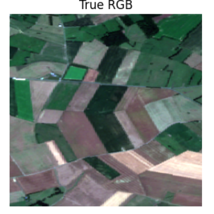
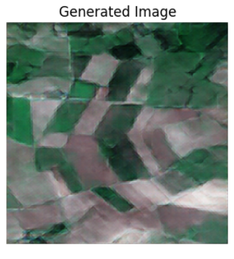

# SAR Image Colorization using U-Net and PatchGAN

## Table of Contents
1. [Introduction](#introduction)
2. [Why Colorize SAR Images?](#why-colorize-sar-images)
3. [Proposed Methodology](#proposed-methodology)
    - [U-Net Generator](#u-net-generator)
    - [PatchGAN Discriminator](#patchgan-discriminator)
4. [Dataset and Preprocessing](#dataset-and-preprocessing)
5. [Results](#results)
    - [Performance Metrics](#performance-metrics)
    - [Sample Outputs](#sample-outputs)
6. [Acknowledgements](#acknowledgements)
7. [Collaborators](#collaborators)

---

## Introduction

This project focuses on the **colorization of SAR (Synthetic Aperture Radar) images**, a process of translating grayscale radar images into meaningful RGB representations. We achieve this by implementing a **deep learning model** using the **U-Net architecture** as a generator and **PatchGAN** as a discriminator within a conditional GAN framework.

---

## Why Colorize SAR Images?

SAR images, generated using radar signals, are widely used in remote sensing applications such as:
- Monitoring deforestation.
- Studying urban development.
- Detecting changes in ice cover.

However, SAR images are typically grayscale, making them less interpretable for visual analysis. By colorizing these images:
- Researchers and analysts can extract information more intuitively.
- Colorization bridges the gap between SAR data and traditional RGB imagery used in computer vision tasks.

---

## Proposed Methodology

### U-Net Generator
The U-Net architecture serves as the **generator** in our GAN framework. It is designed to learn the mapping between input SAR images and their corresponding RGB targets by leveraging **downsampling and upsampling operations with skip connections**.

- **Encoder (Downsampling):** Extracts features using successive convolutional layers with stride 2.
- **Decoder (Upsampling):** Recovers spatial resolution using transpose convolutions, aided by skip connections to preserve fine-grained details.

### PatchGAN Discriminator
The PatchGAN architecture is used as the **discriminator**, which distinguishes between real RGB images and those generated by the U-Net. Instead of evaluating the entire image, PatchGAN focuses on **local patches** (e.g., 70x70), making it computationally efficient while capturing fine-grained details.

### Combined Framework
The generator and discriminator are trained in a **conditional adversarial setting**, where:
- The generator learns to minimize a loss combining **perceptual loss**, **L1 loss**, and **adversarial loss**.
- The discriminator learns to distinguish between real and generated RGB images.

---

## Dataset and Preprocessing

1. **Data Source:**
   - The dataset consists of paired SAR and RGB images, where each SAR image has a corresponding ground truth RGB image.

2. **Preprocessing Steps:**
   - Images are resized to 256x256 for consistency.
   - Normalization is applied to scale pixel values to [-1, 1].

3. **Train-Test Split:**
   - The dataset is split into training (70%), validation (15%), and testing (15%) subsets using `train_test_split` from `scikit-learn`.

---

## Results

### Performance Metrics
To evaluate the quality of colorization, we use the following metrics:
- **SSIM (Structural Similarity Index):** Measures structural similarity between the generated image and ground truth. Higher values (closer to 1) indicate better quality.
- **PSNR (Peak Signal-to-Noise Ratio):** Measures the signal quality. Higher values indicate less noise and higher fidelity.

| Metric | Value       |
|--------|-------------|
| SSIM   | ~0.7113     |
| PSNR   | ~27.01 dB   |

### Sample Outputs
Below are examples of SAR image inputs, their corresponding ground truth RGB images, and the colorized outputs generated by the model:

| SAR Input      | Ground Truth RGB | Generated RGB |
|----------------|------------------|---------------|
|  |  |  |

---

## Acknowledgments
We thank the open-source community for providing:

1. TensorFlow for model building.
2. VGG-19 pre-trained weights for perceptual loss.
3. Publicly available SAR-RGB datasets for training and testing.

### Collaborators
This project was a collaborative effort, many thanks to:

1. R. Pradyumna Prahas
2. N. Anand Sai Subrahmanyam
3. N. Varshith Kumar
